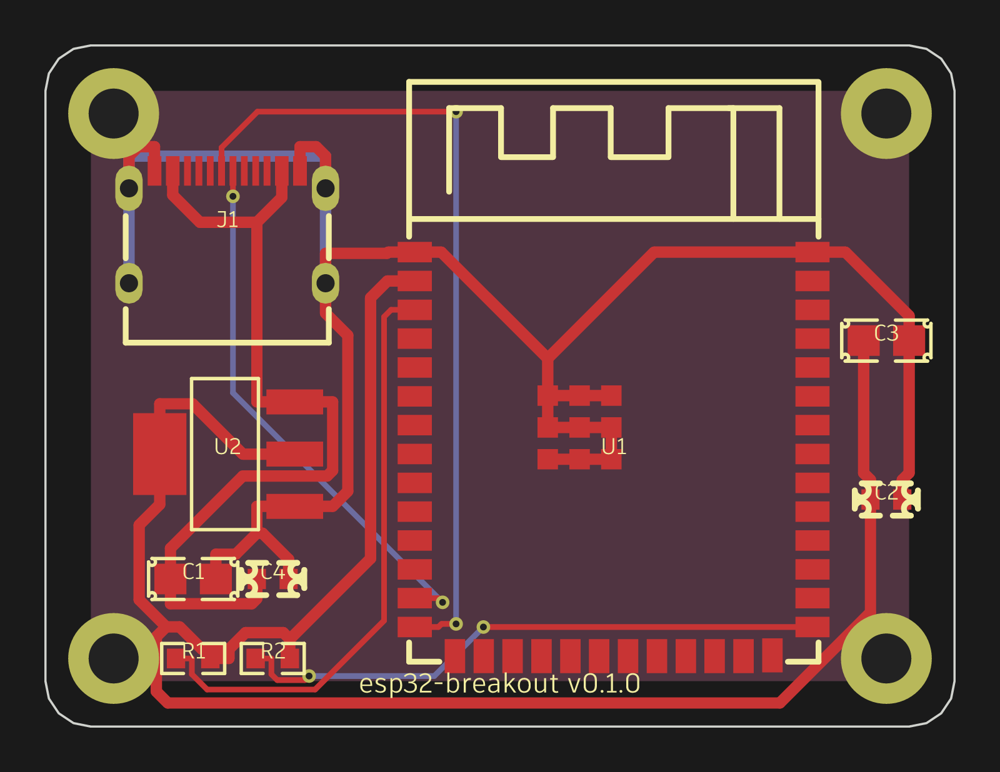

# Flamingo


**Prompt-first PCB CAD for Claude Code.** No schematic step: describe the board
in plain language and Claude Code drives a custom TypeScript engine over MCP —
picking real [LCSC](https://www.lcsc.com/) parts, placing footprints, wiring
connectivity, autorouting with [Freerouting](https://github.com/freerouting/freerouting),
running DRC, and exporting a
[JLCPCB](https://jlcpcb.com/)-ready fab package (`gerbers.zip` + `bom.csv` +
`cpl.csv`). A live browser view shows the board update as it's built.



_The `esp32-breakout` reference board — 40×30mm, 2-layer, ESP32-S3-WROOM-1 +
USB-C + AMS1117-3.3, autorouted and DRC-clean — built end to end through the MCP
tools alone by `packages/server/scripts/e2e-esp32.ts`._

## Quick start

```bash
npm install
npm run build

# Serve a board (creates board.flamingo if it doesn't exist):
node packages/server/dist/cli.js serve board.flamingo
#   … or, once the server package is linked, `npx flamingo serve board.flamingo`

# Open the live view:
open http://localhost:4242
```

Point Claude Code at the running server by dropping this `.mcp.json` in your
project (it's already at the repo root):

```json
{
  "mcpServers": {
    "flamingo": { "type": "http", "url": "http://localhost:4242/mcp" }
  }
}
```

Now ask Claude Code to build a board — e.g. _"make me a 2-layer ESP32-S3
breakout with USB-C power and a 3.3V LDO"_ — and watch the browser view fill in.

## Requirements

- **Node.js 22+**
- **A Java runtime** (for the Freerouting autorouter). On macOS: `brew install
  openjdk` (keg-only — either add `/opt/homebrew/opt/openjdk/bin` to `PATH` or
  set `JAVA_HOME`). `freerouting.jar` is downloaded to `~/.flamingo/` on first
  autoroute.
- **Network** on first use, to fetch part footprints from the EasyEDA/LCSC API
  (cached under `~/.flamingo/parts/` afterward).

## The workflow

```
prompt → parts → place → connect → route → drc → export
```

1. **parts** — `parts_search` (keyword) then `parts_get` (pad list) to choose
   real LCSC parts and learn their pin numbers.
2. **place** — `new_board`, `set_board_outline`, then `place_component` /
   `move_component` to lay out footprints (mm, y-up).
3. **connect** — `connect_pins` builds nets from `REFDES.PAD` pin refs;
   `create_net_class` / `assign_net_class` set track/via/clearance rules.
4. **features** — `add_zone` (copper pours), `add_mounting_hole`, `add_silk_text`,
   `add_keepout`.
5. **route** — `autoroute` runs Freerouting; `get_ratsnest` / `unroute` help
   iterate.
6. **drc** — `run_drc` reports violations against the JLCPCB ruleset for the
   board's layer count.
7. **export** — `export_fab` runs DRC (fills zones first) and writes the
   JLCPCB fileset — refusing on any violation unless `waiveDrc` is set.

`screenshot` renders the board to a PNG at any point so Claude can see what it's
doing.

## MCP tools

28 tools are served at `http://localhost:4242/mcp`:

| Group | Tools |
| --- | --- |
| **Board / project** | `new_board`, `open_board`, `save_board`, `get_board_state`, `describe_connections` |
| **Parts** | `parts_search`, `parts_get` |
| **Placement** | `place_component`, `move_component`, `remove_component` |
| **Connectivity** | `connect_pins`, `disconnect_pins`, `create_net_class`, `assign_net_class` |
| **Board features** | `set_board_outline`, `add_zone`, `add_keepout`, `add_mounting_hole`, `add_silk_text`, `remove_item` |
| **Routing / analysis** | `get_ratsnest`, `autoroute`, `unroute`, `run_drc` |
| **History** | `undo`, `redo` |
| **Output** | `export_fab`, `screenshot` |

## Architecture

npm workspaces monorepo — all packages are ESM, strict TypeScript, tested with
Vitest (`packages/*/test/*.test.ts`):

```
packages/
  engine/   pure library: data model, geometry, netlist/ratsnest, zone fill, DRC, ops
  parts/    LCSC search + EasyEDA footprint fetch/parse/cache
  fab/      Gerber X2 + Excellon writers, BOM/CPL writers, DSN export / SES import
  server/   Node: document host, op-log + undo/redo, HTTP + WebSocket, MCP endpoint, CLI, autoroute runner
  ui/       browser PCB view (Canvas 2D) with mouse editing tools
```

The `server` is the hub: it owns the live `Doc` (board + undo/redo), serves the
`ui` at `/`, streams changes over `/ws`, and exposes every editing operation as
an MCP tool at `/mcp`. Claude Code and the browser both act on the same board.

## Development

```bash
npm run build   # tsc -p . in every package (+ vite build for the ui)
npm test        # vitest run in every package
```

The full prompt→fab pipeline is exercised for real (live LCSC parts, real
Freerouting) by:

```bash
npx tsx packages/server/scripts/e2e-esp32.ts
```

which builds the reference board above, asserts a DRC-clean export, and
tracespace-validates every Gerber.

## License

None yet — this is a private, unpublished project.
